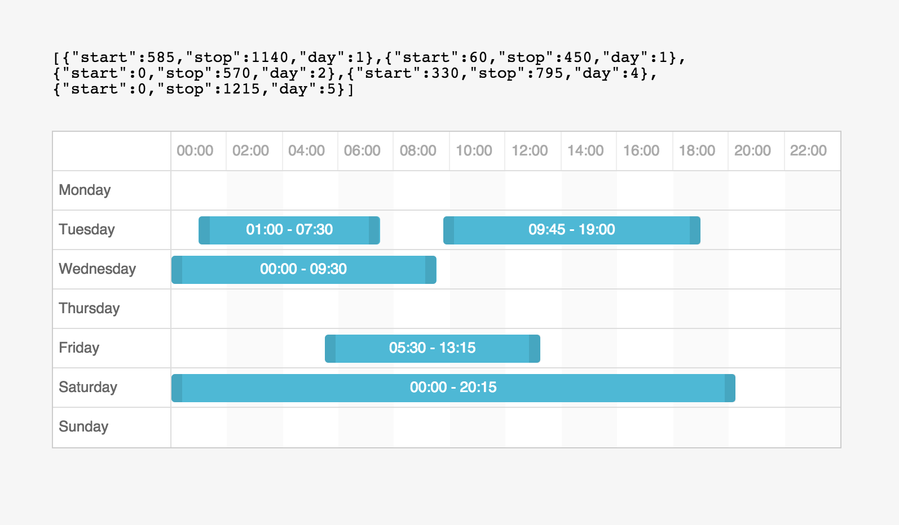

# Angular Scheduler

Collection of widgets to create (weekly) scheduling view.



Decided to make my own, as there didn't seem to be existing tools or sliders with good support for e.g. multiple slots.

Some more or less nice features:

- Slick looks
- Not dependent on e.g. jQuery or jQueryUI
- Automatically merge overlapping slots
- When you flip slot's handles (drag left handle over the right one), this will automatically switch them.

## How to use

In short: see `index.html` for an example.

A bit longer: Include or copy both `lib/angular-scheduler.min.js` and `css/angular-scheduler.css` into your project and add `scheduler` as a dependency to your module. Then in your template:

```
<scheduler class="scheduler" slots="slots"></dayparting>
```

`slots` is a list, where each slot represents one time slot in each day. `start` and `end` are minutes, and `day` is an integer representing day of the week (Monday: 0, Tuesday: 1, Sunday: 6). For example:

```
$scope.slots = [
    {
        start: 0
        end: 180
        day: 0
    },
    { ... }
]
```


## TODO

- Separate layout CSS from purely visual stuff to make it easier to customize looks
- Make each component more independent, so they (especially multislider) could also be used separately


## License

Permission is hereby granted, free of charge, to any person obtaining a copy of this software and associated documentation files (the "Software"), to deal in the Software without restriction, including without limitation the rights to use, copy, modify, merge, publish, distribute, sublicense, and/or sell copies of the Software, and to permit persons to whom the Software is furnished to do so, subject to
the following conditions:

The above copyright notice and this permission notice shall be included in all copies or substantial portions of the Software.

THE SOFTWARE IS PROVIDED "AS IS", WITHOUT WARRANTY OF ANY KIND, EXPRESS OR IMPLIED, INCLUDING BUT NOT LIMITED TO THE WARRANTIES OF MERCHANTABILITY, FITNESS FOR A PARTICULAR PURPOSE AND NONINFRINGEMENT. IN NO EVENT SHALL THE AUTHORS OR COPYRIGHT HOLDERS BE LIABLE FOR ANY CLAIM, DAMAGES OR OTHER LIABILITY, WHETHER IN AN ACTION OF CONTRACT, TORT OR OTHERWISE, ARISING FROM, OUT OF OR IN CONNECTION WITH THE SOFTWARE OR THE USE OR OTHER DEALINGS IN THE SOFTWARE.
